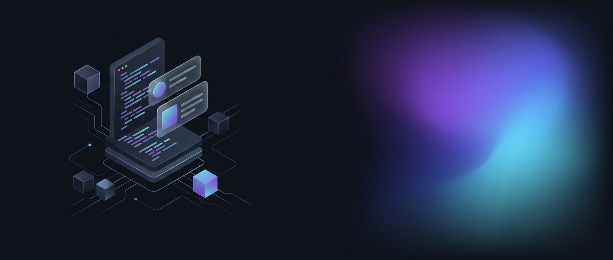

<!-- ============================================================
     PROFILE README — sapnasingh4852-source
     Before pushing: replace the two TODO placeholders in the
     "Connect With Me" section with your real LinkedIn URL and email.
     ============================================================ -->

<div align="center">
  
</div>

<div align="center">
  <a href="https://git.io/typing-svg">
    
  </a>
</div>

<div align="center">
  
</div>

<br/>

<p align="center">
  I design and build <b>complete web applications</b> — responsive frontends, REST APIs, and persistent backends.<br/>
  Currently pursuing <b>B.Tech in CSE (AI &amp; ML)</b> while shipping real full-stack projects with
  <b>Node.js · Express · MongoDB · React</b>.
</p>

<p align="center">
  
</p>

---

## 🧭 Currently Focused On

```text
▸ Building full-stack applications (Node.js + Express + MongoDB + EJS/React)
▸ Backend engineering — REST APIs, authentication, sessions, MVC architecture
▸ Data Structures & Algorithms in C++
▸ Writing cleaner, documented, production-minded code
```

---

## 🛠️ Tech Stack

**Languages**


**Frontend**


**Backend**


**Database**


**Tools**


---

## 🚀 Featured Projects

| Project | What it does | Stack |
| --- | --- | --- |
| **[Hostel Management System](https://github.com/sapnasingh4852-source/HostelMangementSystem)** | Full-stack platform for hostel blocks, room allotments, complaint ticketing, mess menus & monthly billing — with admin dashboards and concurrency-safe booking | `Node.js` `Express` `MongoDB` `EJS` |
| **[Pizza Corner](https://github.com/sapnasingh4852-source/pizzastore)** | Food-ordering web app with menu browsing, cart logic and session-based auth | `Node.js` `Express` `MongoDB` `EJS` |
| **[Library Management System](https://github.com/sapnasingh4852-source/librarymangement)** | Full-stack library app with controllers, models, routes & middleware in MVC structure | `Node.js` `Express` `MongoDB` `EJS` |
| **[Student Manager](https://github.com/sapnasingh4852-source/Mani_weekly_test_project)** | Student records CRUD app with clean MVC separation | `Express` `MongoDB` `Mongoose` `EJS` |
| **[QRLink Generator](https://github.com/sapnasingh4852-source/qrlink-generator)** | Client-side QR code generator for URLs — zero build step, works offline | `JavaScript` `HTML` `CSS` |
| **[Weather App](https://github.com/sapnasingh4852-source/weather)** | Live weather lookup app powered by a public weather API | `JavaScript` `REST API` `HTML` `CSS` |

---

## 📊 GitHub Stats

<div align="center">
  
  
</div>

<div align="center">
  
</div>

---

## 🧊 3D Contribution Graph

<div align="center">
  
</div>

<div align="center">
  <picture>
    <source media="(prefers-color-scheme: dark)" srcset="https://raw.githubusercontent.com/sapnasingh4852-source/sapnasingh4852-source/output-snake/snake-dark.svg" />
    <source media="(prefers-color-scheme: light)" srcset="https://raw.githubusercontent.com/sapnasingh4852-source/sapnasingh4852-source/output-snake/snake.svg" />
    
  </picture>
</div>

---

## 🤝 Connect With Me

<!-- TODO: replace LINKEDIN_URL and your email below with your real links -->

<div align="center">
  <a href="https://www.linkedin.com/in/LINKEDIN_URL"></a>
  <a href="https://github.com/sapnasingh4852-source"></a>
  <a href="mailto:YOUR_EMAIL@gmail.com"></a>
</div>

<br/>

<div align="center">
  
</div>
